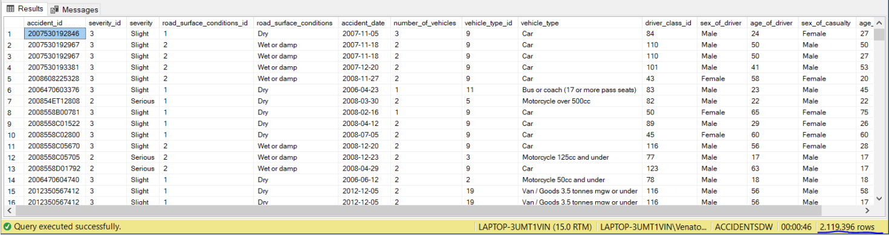
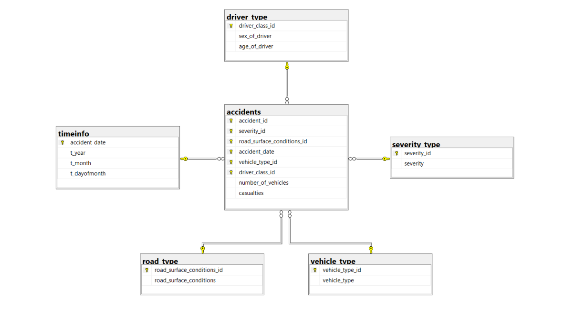
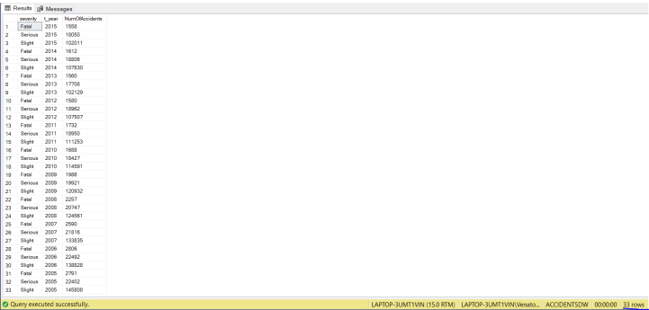
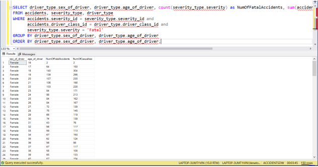
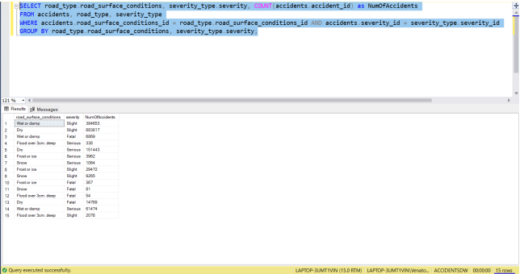
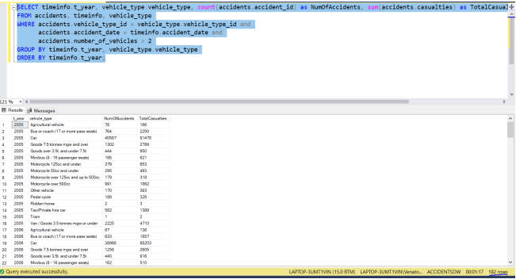
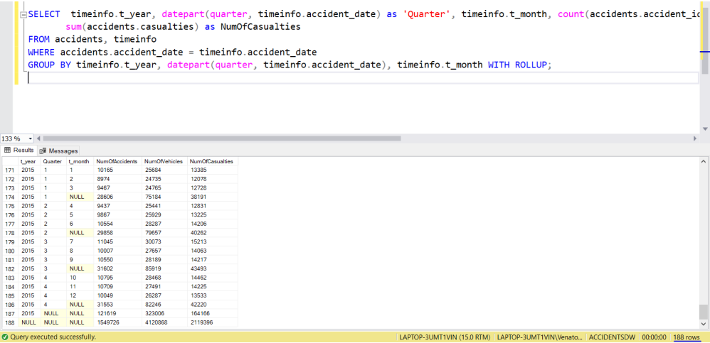
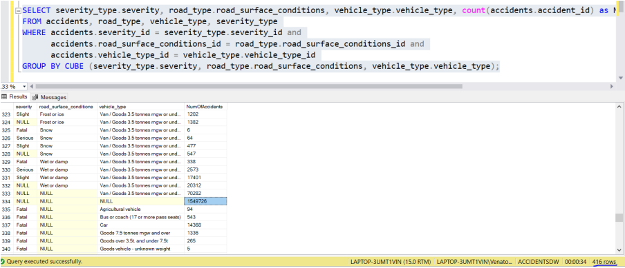
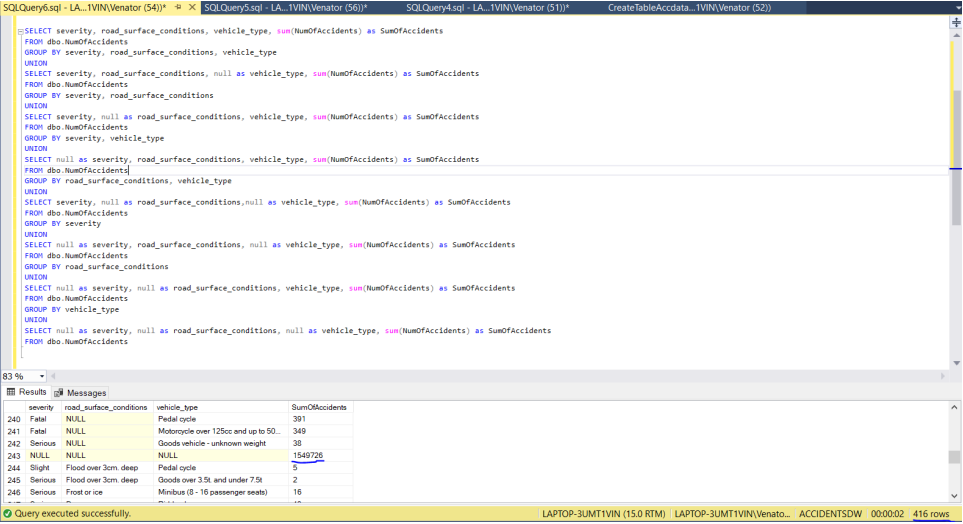

# **About this project**

> The purpose of this project is to create a Data Warehouse. The following is a **hypothetical scenario** for the assignment: <br> The Department of Transportation in England is interested in developing a data warehouse with the aim 
> of deriving useful information for policy-making about road safety and the reduction of fatal traffic accidents. 

# **Contents**
- [**About this project**](#about-this-project)
- [**Contents**](#contents)
- [**Data to be analyzed**](#data-to-be-analyzed)
- [**Dataset**](#dataset)
  - [**Dataset overview**](#dataset-overview)
- [**Project Tasks**](#project-tasks)
  - [**Preparing Data**](#preparing-data)
    - [**Creating the accdata table**](#creating-the-accdata-table)
    - [**Loading the dataset**](#loading-the-dataset)
    - [**Implement Star-Schema**](#implement-star-schema)
    - [**Star Schema diagram**](#star-schema-diagram)
  - [**Statistical Reports**](#statistical-reports)
    - [**1st Query**](#1st-query)
    - [**2nd Query**](#2nd-query)
    - [**3rd Query**](#3rd-query)
    - [**4th Query**](#4th-query)
    - [**5th Query**](#5th-query)
  - [**Data Cube**](#data-cube)
- [**Final Notes**](#final-notes)

# **Data to be analyzed**

> The ministry's requirements focus on analyzing the following:

* The **number of traffic accidents** 
* The **number of victims**
* The **number of vehicles** involved

> All of the above are also analyzed based on the following characteristics of the at-fault driver and the vehicle that caused the accident:

* The **gender** 
* The **age** 
* The **type of vehicle** 
* The **severity of the accident**
* The **surface conditions** at the scene of the accident
* Any other combination thereof. 

> During the analysis of the data **the time factor** should also be taken into account so that the competent authorities are able to produce statistical reports with the data of **accidents per month, quarter and year**.

# **Dataset**

>   * Download the dataset from this [Google Drive link](https://drive.google.com/file/d/1z9kydRlVI_Il_SNxKG4EypSDRXxV6rOf/view?usp=sharing)
>   * The dataset `ACCDATA.TXT` file should be stored in the [`data`](data) directory. Paste your downloaded file there before going any further.

> The `ACCDATA.TXT` file contains **2,119,396 records**. Each record consists of 14 fields separated by the character "|" (pipe). Here's a quick rundown of the fields:

## **Dataset overview**

| Field | Type | ACCDATA.TXT |
| ------- | ------- | ------- |
| **accident_id** | `varchar(15)` | Accident code |
| **severity_id** | `integer`     | Severity code |
| **severity** | `varchar(10)` | Characterization of the accident's severity (fatal, serious, etc.) |
| **road_surface_conditions_id** | `integer` | Road Condition Code |
| **road_surface_conditions** | `varchar(50) ` | Condition of the road surface at the point of the accident |
| **accident_date** | `date` | Date of the accident |
| **number_of_vehicles** | `integer` | The number of vehicles involved in the accident |
| **vehicle_type_id** | `integer` | Category code of the vehicle which caused the accident |
| **vehicle_type** | `varchar(50)` | Category of the vehicle that caused the accident |
| **driver_class_id** | `integer` | Driver category code. It expresses the category in which the driver responsible for the accident is classified according to gender and age. *E.g. 20-year-old female drivers are classified in category 5 (5, Female, 20).* |
| **sex_of_driver** | `varchar(6)` | The gender of the driver responsible for the accident |
| **age_of_driver** | `integer` | The age of the driver responsible for the accident |
| **sex_of_casualty** | `varchar(6)` | The victim's gender. A victim is any person who lost their life, was seriously injured, or was slightly injured as a result of the accident. |
| **age_of_casualty** | `integer` | Age of victim |

# **Project Tasks**

> The following are the steps in order to make the data warehouse discribed above.

## **Preparing Data**

> Create the logical schema of the data warehouse and feed it with the necessary data. 

### **Creating the accdata table** 

Create the accdata table by running the script [`accdata.sql`](sql_scripts/accdata.sql), it should return **`2,119,396 rows`**.



### **Loading the dataset**

> Create a database named **ACCIDENTSDW** (Accidents Data Warehouse). Then create the table **accdata** the data from the ACCDATA.TXT file are going to be stored, using the following command:

**Please edit the data path in the query below before executing it, so that it points to the location that the `ACCDATA.TXT` file is located!**

```
BULK INSERT accdata
FROM 'C:\data\ACCDATA.TXT' 
WITH (FIRSTROW =2, FIELDTERMINATOR='|', ROWTERMINATOR = '\n');
```

### **Implement Star-Schema**

> Implement the logical schema of the data warehouse which should have the form of a star (Star Schema).

Create the **Star Schema** by running the script [`star_schema.sql`](sql_scripts/star_schema.sql).

> Write appropriate commands in SQL language, which will feed the warehouse schema with the necessary data from the accdata table.

Feed the **Star Schema** with data from the `accdata` table by running the script [`insert_star_schema.sql`](sql_scripts/insert_star_schema.sql), it should return **`1,549,726 rows`**.

### **Star Schema diagram**

> Print the data warehouse's schema by utilizing the SQL Server Management Studio's "Database diagrams" option.

The **Star Schema** should look something like so:



## **Statistical Reports**

> Using the data warehouse you created in the previous question, write and run SQL queries that answer the following ministry management questions (requirements):

### **1st Query**

> Display a list of the number of accidents per year and accident severity. The list should be sorted by year in descending order.

Run the [`1st_query.sql`](sql_scripts/1st_query.sql) script, it should return the list as described above like so **`33 rows`**:



### **2nd Query**

> Display a list with the number of fatal accidents (Fatal) and the total number of their victims by gender and age of the at-fault driver (driver responsible for the accident).

Run the [`2nd_query.sql`](sql_scripts/2nd_query.sql) script, it should return the list as described above like so **`150 rows`**:



### **3rd Query**

> Display a list with a breakdown of the number of accidents based on road surface conditions and accident severity.

Run the [`3rd_query.sql`](sql_scripts/3rd_query.sql) script, it should return the list as described above like so **`15 rows`**:



### **4th Query**

> Display a list of the number of accidents and the number of their victims by year and type of vehicle (vehicle type) that caused the accident. **The list should only be calculated for accidents involving more than 2 vehicles**.

Run the [`4th_query.sql`](sql_scripts/4th_query.sql) script, it should return the list as described above like so **`182 rows`**:



### **5th Query**

> Ministry management wants a report containing the following information **using one query only**.
>   * The total number of accidents, the total number of vehicles involved in an accident and the total number of victims during the decade (2005 to 2015)
>   * The number of accidents, the number of vehicles that were involved in an accident and the number of victims on an annual basis
>   * The number of accidents, the number of vehicles that were involved in an accident and the number of victims per quarter and month of each year.

Run the [`5th_query.sql`](sql_scripts/5th_query.sql) script, it should return the list as described above like so **`188 rows`**:



The number of total accidents, vehicles and victims:
* The decade is listed in **the last row** of the query, where all the fields in which the group by is done, have the value NULL.
* On a yearly basis they are listed in the **rows where the attribute `t_year` takes the value `2015`** for example and the attributes **`Quarter` and `t_month` take values `NULL`**.
c. Results by quarter are listed in the rows where **the attribute `t_month` takes the value `NULL`**, for example in `row 174`, the results for the 1st quarter of the year 2015 are listed. In the rows **where no `NULL` appears in the group by attributes**, the results are listed by **month**, for example `row 171` shows the results for **January 2015**.

## **Data Cube**

> Write a query in SQL, the result of which is the creation of a cube (data cube), each cell of which contains the number of accidents for a certain combination of values: 
>   * accident severity (**severity**)
>   * **road_surface_conditions**
>   * type of vehicle that caused the accident (**vehicle_type**).

Run the [`data_cube.sql`](sql_scripts/data_cube.sql) script, it should return the list as described above like so **`416 rows`**:



> Let's say that the DBMS does not support the `CUBE` operator to create cube like before, nor the `GROUP BY GROUPING SETS` command, only the `GROUP BY` command. Create a MATERIALIZED view (`INDEXED VIEW` in SQL SERVER) that will contain the result of a single `GROUP BY` of the cube in the previous query. Write appropriate SQL statements to generate the rest of the `GROUP BY` of the cube from the view you created.

Run the [`cube_group_by.sql`](sql_scripts/cube_group_by.sql) script, it should return same result as before like so **`416 rows`**, the view created should have **`277 rows`**:



# **Final Notes**

> There is a final script, [**`final_script.sql`**](sql_scripts/final_script.sql) containing all of the scripts ran in this project, if you wish to run them in one go.